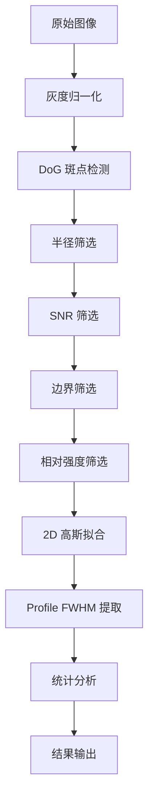

# OCT 横向分辨率计量 - 算法理论

**版本**: v1.0  
**更新日期**: 2026-01-20

---

## 1. 物理背景

### 1.1 点扩散函数 (PSF) 与分辨率

OCT 系统对理想点目标的成像响应称为**点扩散函数 (Point Spread Function, PSF)**。横向分辨率定义为 PSF 的**半高全宽 (Full Width at Half Maximum, FWHM)**。

微球体模中的微球（直径 < 光束腰斑）近似为点目标，其 B-scan 成像可视为系统 PSF 的直接采样。

### 1.2 高斯模型

假设 PSF 为轴对齐的 2D 高斯分布：

$$ I(x,z) = I_A \exp \left( -\frac{(x-x_0)^2}{2\sigma_x^2} - \frac{(z-z_0)^2}{2\sigma_z^2} \right) + I_{bg} $$

其中：

- $(x_0, z_0)$: 光斑中心（亚像素精度）
- $\sigma_x, \sigma_z$: 横向/轴向标准差
- $I_A$: 峰值幅度
- $I_{bg}$: 背景基线

FWHM 与标准差的换算关系：

$$ FWHM = 2\sqrt{2\ln 2} \cdot \sigma \approx 2.355 \sigma $$

---

## 2. 算法流水线

---

## 3. 检测阶段

### 3.1 DoG (Difference of Gaussian) 斑点检测

**原理**: 利用高斯差分金字塔模拟带通滤波器，匹配特定尺度的亮斑。

**参数设置**:

- `min_sigma` = min_diameter_um / (2 × pixel_scale) / √2
- `max_sigma` = max_diameter_um / (2 × pixel_scale) / √2
- `threshold` = background_threshold / 65535

**物理意义**: DoG 是 Laplacian of Gaussian (LoG) 的高效近似，对类高斯目标的响应最强。

---

## 4. 筛选阶段

### 4.1 半径筛选

剔除尺寸异常的候选点：

- 绝对下限: FWHM < 3.0 px
- 相对范围: 0.3 × psf_radius < FWHM < 2.0 × psf_radius
- MAD 离群值检测

### 4.2 SNR 筛选

计算局部信噪比：

$$ SNR = \frac{I_{peak} - I_{bg\_mean}}{I_{bg\_std}} $$

**阈值**: SNR > 8.0 (可配置)

**物理意义**: 确保检测到的是真实物理反射而非热噪声。

### 4.3 相对强度筛选

**原理**: 真实靶球通常是全图最亮的物体（中心扫描的镜面反射）。

**参数**:

- `percentile = 90.0`: 以最亮 10% 球的亮度作为参考
- `threshold_ratio = 0.35`: 至少达到参考亮度的 35%

### 4.4 边界筛选

剔除距离图像边缘过近的目标，避免 Profile 提取不完整。

**边界留白**: 2 × 球半径

---

## 5. 拟合阶段

### 5.1 2D 高斯拟合

使用 Levenberg-Marquardt 算法进行非线性最小二乘拟合。

**拟合参数**: amplitude, x0, y0, sigma_x, sigma_y, background

**质量检查**:

| 指标 | 阈值 | 物理意义 |
|------|------|---------|
| 轴比 | 1.0 - 3.0 | 排除过度拉长的伪影 |
| 残差 | < 0.25 | 拟合优度 |
| FWHM | 5 - 50 µm | 物理合理范围 |

### 5.2 Profile FWHM 提取

对通过拟合的目标，提取横向积分曲线并计算离散 FWHM。

**步骤**:

1. 纵向积分获得 1D Profile
2. 高斯平滑去噪
3. 归一化至 [0, 1]
4. 插值找半高点
5. 计算 FWHM (px) → 转换为 µm

---

## 6. 统计输出

**有效样本标准**: 通过所有筛选的微球

**统计指标**:

- 均值 (Mean)
- 标准差 (Std)
- 最小值 / 最大值
- 有效样本数

**警告条件**: 有效样本数 < 50

---

## 7. 参考文献

1. Schmitt, J.M. (1999). Optical coherence tomography (OCT): a review. *IEEE J. Sel. Top. Quantum Electron.*
2. Nord, M. et al. (2017). Atomap: a new software tool for the automated analysis of atomic resolution images. *Adv. Struct. Chem. Imag.*
