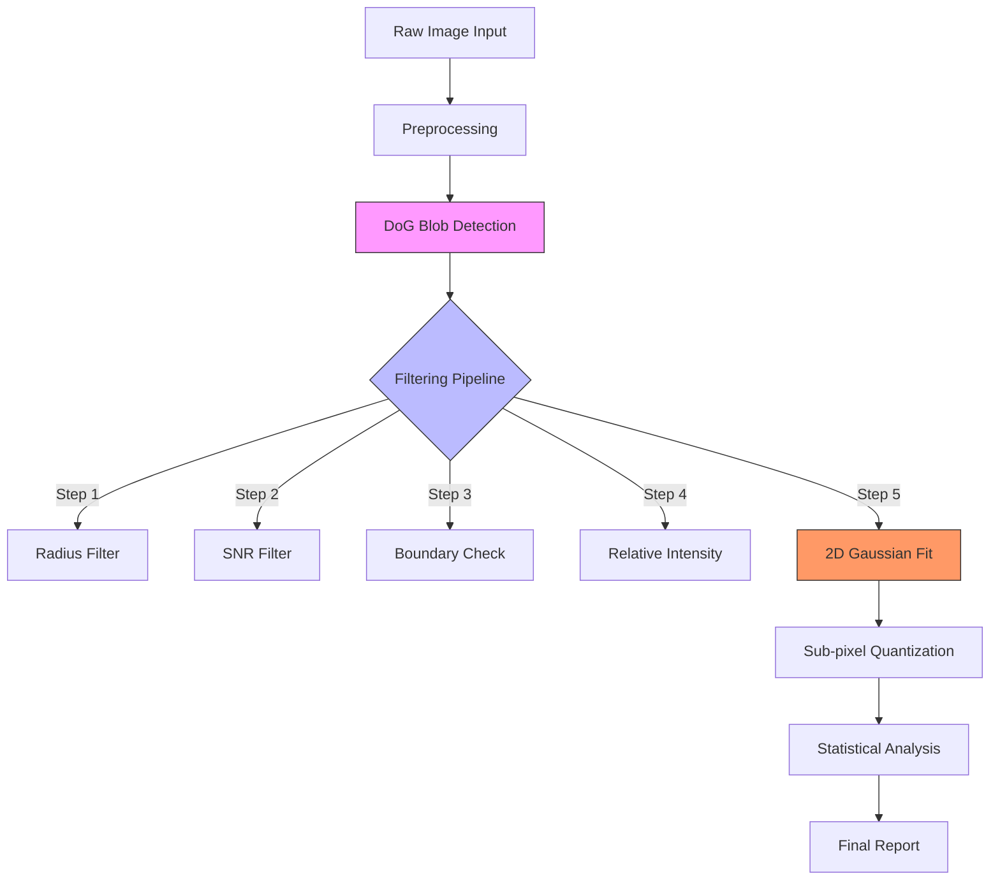

# OCT 横向分辨率自动计量项目分析报告

**版本**: 1.0  
**日期**: 2026-01-19  
**面向对象**: OCT 计量专家 / 算法开发团队  

---

## 1. 项目背景与架构概述

本项目旨在开发一套自动化的 **OCT 横向分辨率（Lateral Resolution）** 计量验证系统。利用内嵌微球粒子的体模（Phantom）图像，通过计算机视觉算法自动提取并分析微球的点扩散函数（PSF），实现这一关键性能指标的客观评价。

### 1.1 系统架构

系统采用模块化分层设计，主要包含：

* **前端 GUI (`app/`)**: 基于 PySide6 的现代化界面，提供交互式 ROI 选择、参数配置、实时预览以及结果可视化（直方图、Profile 曲线、统计表格）。
* **核心算法层 (`core/`)**:
  * **Detection**: 基于 DoG (Difference of Gaussian) 的多尺度斑点检测。
  * **Filtering**: 多级级联筛选器（半径、SNR、边界、相对强度、2D 高斯拟合残差）。
  * **Analysis**: 亚像素级 FWHM 测量、Profile 提取与统计计算。
* **数据模型 (`core/models.py`)**: 严格定义的物理参数（µm）与像素参数转换模型。

### 1.2 关键功能

* **全自动检测**: 能够从高噪声的 OCT B-Scan 图像中自动识别数以千计的有效微球目标。
* **亚像素精度**: 对每个检出的微球进行 2D 高斯曲面拟合，提取中心坐标和 FWHM。
* **统计分析**: 由于单次 B-Scan 包含大量样本，系统通过统计方法计算平均分辨率及标准差，试图给出一个稳健的评估值。

#### 1.3 核心算法流程详解

系统的数据处理管线包含以下关键步骤，确保了从原始图像到亚像素测量的稳健性。

##### 关键步骤原理与物理意义

1. **DoG (Difference of Gaussian) 检测 (管线起点)**
    * **原理**: 利用高斯差分金字塔模拟带通滤波器。
    * **物理意义**: 匹配特定尺度的“亮斑”。DoG 是最符合微球 PSF 物理模型的检测器，能有效抑制散斑噪声。

2. **SNR 筛选 (Step 2)**
    * **原理**: 计算光斑信噪比 $SNR = (I_{peak} - I_{bg\_mean}) / I_{bg\_std}$。
    * **物理意义**: 剔除“虚警”。确保检出点为真实物理反射而非随机热噪声。

3. **相对强度筛选 (Step 4)**
    * **原理**: 剔除强度低于全局动态范围一定比例（如 35%）的暗弱光斑。
    * **物理意义**: 保证信号质量。光斑强度过低意味着处于系统灵敏度滚降区，其形态已不可靠。

4. **2D 高斯拟合与残差筛选 (Step 5)**
    * **原理**: 使用 Levenberg-Marquardt 算法进行亚像素级非线性回归：

$$ I(x,z) = I_A \exp \left( -\frac{(x-x_0)^2}{2\sigma_x^2} - \frac{(z-z_0)^2}{2\sigma_z^2} \right) + I_{bg} $$

    *   **物理意义 (计量核心)**:
        *   **验证 PSF 形态**: 只有符合理想高斯分布的目标才被视为有效。
        *   **亚像素定位**: 将定位精度从 1px 提升至 0.1px 级别。
        *   **解析 FWHM**: 通过拟合参数 $\sigma$ 精准计算分辨率：
            $$ FWHM = 2\sqrt{2\ln 2} \sigma \approx 2.355 \sigma $$

5.  **算法偏差权衡**:
    *   目前的残差筛选倾向于保留形态“完美”的光斑。但在深层，虽然光斑因 SNR clipping 变小，但其中心尖峰往往仍满足高斯分布，导致系统误将其识别为“超高性能”结果。

---

## 2. 实验现象与问题分析

在近期的验证测试中，特别是通过 **深度-分辨率散点图（Depth vs Resolution Plot）** 分析和 **同图不同 ROI 对比实验**，发现了当前计量方法论中的一个核心缺陷。

### 2.1 现象描述

1. **同图不同结果 (Use Case 1)**: 对同一张 10µm 微球图像，若分别选择不同深度的 ROI 进行分析，结果差异符合 SNR 衰减规律。
    * **浅层 (Shallow)**: 光进入介质路径短，回光强度高（高 SNR）。光斑形态理想，面积较大且边缘轮廓清晰。计算得到的横向分辨率数值（FWHM）相对**较大**，但这代表了完整光斑的真实宽度，因此结果**更准确**。
    * **深层 (Deep)**: 光深入介质后衰减严重，回光强度低（低 SNR）。光斑边缘被噪声淹没，表现为尺寸较小的“残点”。计算得到的横向分辨率数值**偏小**（看似“分辨率更好”），但这实际上是被截断后的测量假象。

2. **深度趋势 (Use Case 2)**: 散点图显示，随着深度 Z 增加，测得的横向分辨率数值（FWHM）呈现**减小**的趋势。这与通常光学散焦导致光斑变大的直觉相反，说明在此系统中，**信号衰减（Sensitivity Roll-off）** 对测量结果的影响压倒了光学散焦。

### 2.2 物理根源分析：信噪比截断效应 (SNR Clipping)

通常 OCT 系统存在光学散焦导致分辨力随深度下降的现象。但在本项目的高散射体模实验数据中，观察到的主导机制是 **信号强度滚降 (Sensitivity Roll-off)**：

* **浅层高 SNR 区域**: 信号远高于背景噪声底（Noise Floor）。算法能提取到光斑的完整高斯轮廓（包括原本微弱的裙边/Tail），因此拟合出的 FWHM 宽度较大，反映了卷积后的真实光斑直径。
* **深层低 SNR 区域**: 信号强度逼近噪声底。光斑的边缘（裙边）完全被埋没在噪声中，算法只能检测到光斑最中心的顶端（Tip）。对被噪声“削边”后的残缺光斑进行高斯拟合，必然会得到一个**虚假的窄宽度**（Small Sigma）。

**结论**: “深层分辨率好（数值小）”是一个典型的由**低信噪比**导致的测量假象。浅层的高信噪比数据才代表了系统的真实解析能力。

### 2.3 算法层的偏差

当前的筛选逻辑未能有效区分“真实完整的光斑”和“由于噪声截断变小的光斑”：

* **小尺寸偏好**: 算法倾向于认为“越小越好”（代表分辨率高），因此容易保留深层那些被截断的残点。
* **后果**: 深层低质量数据大量混入统计，拉低了平均 FWHM 数值，导致系统评估结果虚高（显得分辨率比实际更好），掩盖了真实性能。

---

## 3. 改进建议与优化方向

为了解决“深层噪声伪影导致分辨率读数虚假改善”的问题，确保计量结果反映真实的系统性能，建议从以下方向优化：

### 3.1 基于信噪比的置信度权重 (SNR-Weighted Confidence)

* **高信噪比优先**: 放弃全图平均，转而寻找**高信噪比区域（High SNR Region）**。只有在信号强度充足（如浅层）的区域，测得的 PSF 才是完整的，FWHM 读数才具备可信度。
* **深层数据降权/剔除**: 识别并标记深层低 SNR 数据。对于形态残缺、主要由噪声截断导致的“小光斑”，应给予极低置信度或直接剔除，防止其拉低平均 FWHM 数值（即防止其让结果看起来“更好”）。

### 3.2 寻找“最大稳定分辨率”而非“最小值”

* 如果物理规律是深层分辨率本应变差（数值变大），但实测数值反而变小（由于噪声截断），那么**真实的系统分辨率**应该是浅层区域测得的**较大且稳定**的数值。
* **策略调整**: 寻找 Resolution vs Depth 曲线中 **SNR > 阈值** 且 **FWHM 数值趋于稳定** 的区域，将其作为 Nominal Resolution 的报告值。

### 3.3 深度补偿与归一化

* **Roll-off 补偿**: 在检测前对图像进行深度方向的亮度补偿，尝试恢复深层信号的对比度（虽然无法恢复丢失的物理信息，但有助于改善筛选逻辑）。

---

## 4. 总结

本项目已具备强大的微球检测与量化能力。目前的挑战在于如何处理 OCT 特有的**深度-信噪比衰减**问题。数据分析表明，浅层的高信噪比数据提供了最准确的 PSF 测量，而深层的“超高分辨率”读数实为噪声截断造成的假象。未来的优化重点应在于**智能识别高置信度区域**，自动摒弃深层噪声干扰，输出更稳健、更真实的计量报告。
